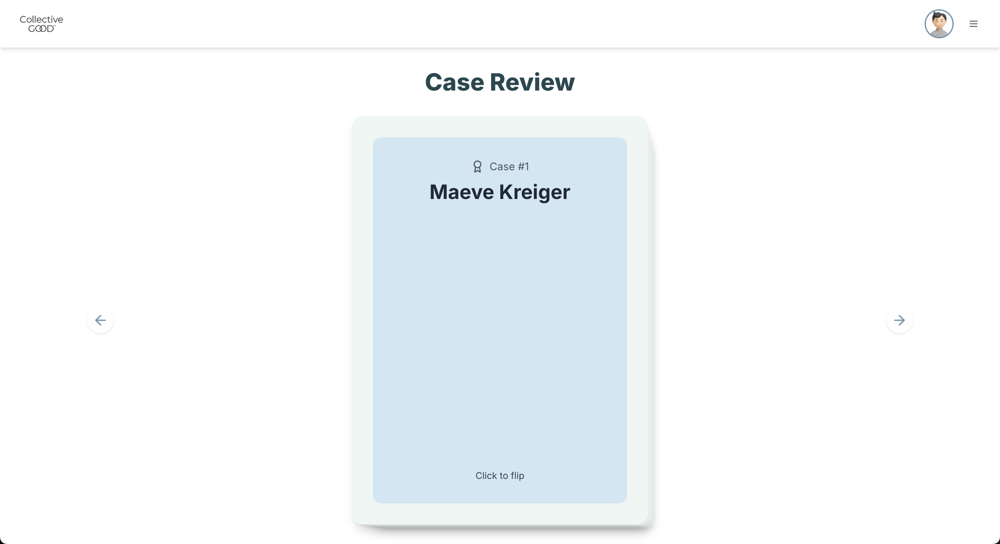

# GIL-DHEP App

A full‐stack platform for refining large-language models in primary-care diagnostics using expert feedback. Licensed clinicians review patient vignettes (real vs. synthetic) to train and evaluate AI, with a responsive Next.js frontend and an Express + TypeScript backend.

<p align="center">
  
</p>

> [!NOTE]
> This project is currently in development and not yet deployed!

---

## 📁 Repository Structure

```
/
├── backend/               # Express API (TypeScript + TypeORM)
│   ├── src/
│   │   ├── controllers/   # Route handlers (Auth, Users, Cases, Assignments, Responses)
│   │   ├── entities/      # TypeORM entities (User, Case, Assignment, UserResponse)
│   │   ├── middlewares/   # Auth, error handling, etc.
│   │   ├── routes/        # Express routers
│   │   ├── utils/         # S3 upload, CSV export, JWT, etc.
│   │   ├── index.ts       # App initialization
│   │   └── data-source.ts # TypeORM datasource
│   ├── scripts/           # Seed scripts, assignment helpers
│   ├── swagger/           # Swagger‐JSDoc decorators
│   ├── tsconfig.json
│   └── package.json
├── frontend/              # Next.js UI (TypeScript + TailwindCSS + shadcn/ui)
│   ├── public/            # Static assets (logo, default avatar, etc.)
│   ├── src/
│   │   ├── components/    # Layout, UI primitives
│   │   ├── hooks/         # Authentication & data hooks
│   │   ├── lib/           # Axios API client
│   │   └── pages/         # Next.js pages (login, signup, profile, FAQ, case review)
│   ├── tailwind.config.js
│   ├── tsconfig.json
│   └── package.json
├── README.md              # <-- you are here
└── package.json           # Root scripts & formatting
```

---

## 🚀 Quickstart

### Prerequisites

- Node.js ≥ 18
- PostgreSQL database up and running
  - If you don't have PostgreSQL installed, go to [PostgreSQL Downloads](https://www.postgresql.org/download/) and follow the instructions for your OS.
- AWS S3 bucket for avatar storage
- `NEXT_PUBLIC_API_URL` pointing to backend (e.g. `http://localhost:5001/api`)

---

### 1. Backend Setup

```bash
cd backend
cp .env.example .env
# Edit .env:
#  - DB_HOST, DB_PORT, DB_USER, DB_PASS, DB_NAME, DB_SSL
#  - JWT_SECRET, JWT_EXPIRES
#  - AWS_REGION, AWS_ACCESS_KEY_ID, AWS_SECRET_ACCESS_KEY, S3_BUCKET
npm install
npm run typeorm migration:run   # if using migrations
npm run seed:cases              # optional: pre‐populate cases
npm run dev                     # starts on localhost:5001
```

- **Swagger UI** available at `http://localhost:5001/docs`
- Raw OpenAPI JSON: `http://localhost:5001/api-docs.json`

---

### 2. Frontend Setup

```bash
cd frontend
cp .env.local.example .env.local
# Set NEXT_PUBLIC_API_URL=http://localhost:5001/api
npm install --legacy-peer-deps # IMPORTANT: Shadcn UI requires this
npm run dev   # starts on localhost:3000
```

- Visit `http://localhost:3000` → you’ll be redirected to the Swagger docs.
- After login, the “Case Review” deck appears.

---

## 🛠️ Scripts

### Backend (`backend/package.json`)

| Command               | Description                                         |
| --------------------- | --------------------------------------------------- |
| `npm run dev`         | Run in dev mode with automatic reload (ts-node-dev) |
| `npm run start`       | Run production (ts-node)                            |
| `npm run build`       | Compile TS to `dist/`                               |
| `npm run typeorm`     | Direct TypeORM CLI commands                         |
| `npm run seed:cases`  | Seed database with synthetic cases                  |
| `npm run assign:user` | Manually assign cases to a given user               |

### Frontend (`frontend/package.json`)

| Command         | Description                    |
| --------------- | ------------------------------ |
| `npm run dev`   | Next.js dev server (Turbopack) |
| `npm run build` | Build for production           |
| `npm run start` | Start built app                |
| `npm run lint`  | ESLint & Prettier check        |

### Root

| Command        | Description         |
| -------------- | ------------------- |
| `npm run lint` | Prettier formatting |

---

## 📝 Environment Variables

| Name                        | Purpose                             |
| --------------------------- | ----------------------------------- |
| **Backend**                 |                                     |
| `PORT`                      | Server port (default `5001`)        |
| `DB_HOST` … `DB_NAME`       | PostgreSQL connection               |
| `DB_SSL`                    | `true`/`false` SSL mode             |
| `JWT_SECRET`, `JWT_EXPIRES` | Auth token secrets                  |
| `AWS_REGION`, … `S3_BUCKET` | S3 credentials & bucket for avatars |
| **Frontend**                |                                     |
| `NEXT_PUBLIC_API_URL`       | e.g. `http://localhost:5001/api`    |

---

## 🔍 API Overview

- **Auth**

  - `POST /api/auth/signup`
  - `POST /api/auth/login`
  - `POST /api/auth/logout`
  - `POST /api/auth/verify-email`
  - `POST /api/auth/reset-password`

- **Users**

  - `GET /api/users/me`
  - `PUT /api/users/me`
  - `POST /api/users/me/avatar`
  - `DELETE /api/users/me/avatar`

- **Cases**

  - `POST /api/cases/upload` (CSV)
  - `GET /api/cases`
  - `GET /api/cases/export`

- **Assignments**

  - `GET /api/assignments` (admin)
  - `GET /api/assignments/me`
  - `POST /api/assignments`

- **Responses**

  - `POST /api/responses`
  - `GET /api/responses/me`

Full schemas and examples are in Swagger UI.

---

## 🧩 Architecture & Design

1. **Express + TypeScript** for backend, with TypeORM for data modeling and migrations.
2. **Next.js** for frontend, leveraging **shadcn/ui**, **Radix**, and **TailwindCSS** for a consistent, responsive design.
3. **Framer-Motion** for smooth page/card animations.
4. **Sonner** for toast notifications.
5. **AWS S3** for storing user avatars.
6. **CSV import/export** for bulk case management.

---

## 💡 Contributing

1. Fork & clone.
2. `npm install` in both `/backend` and `/frontend`.
3. Implement feature or fix bug.
4. Add/update tests (Jest in backend; Cypress or React Testing Library in frontend).
5. Submit PR with descriptive title and changelog.

---

## 📄 License

MIT Licence © UNC DHEP Lab

---
